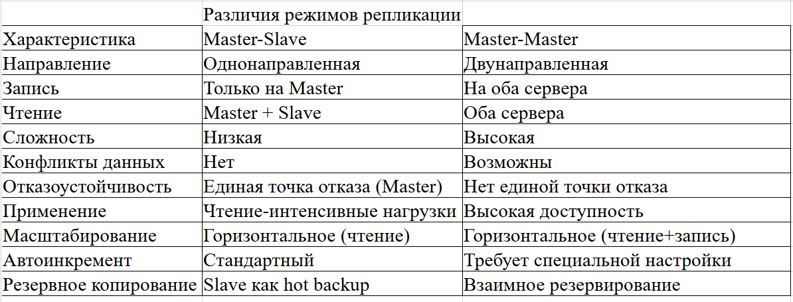
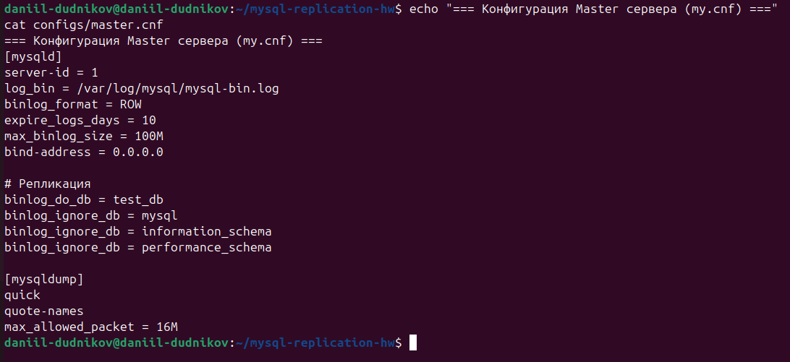
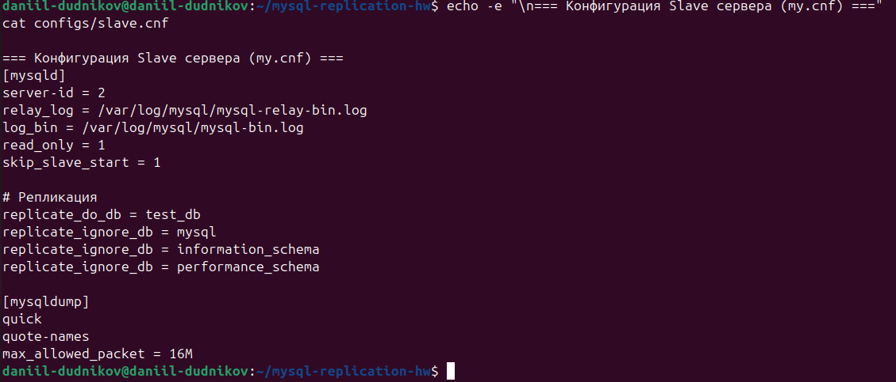
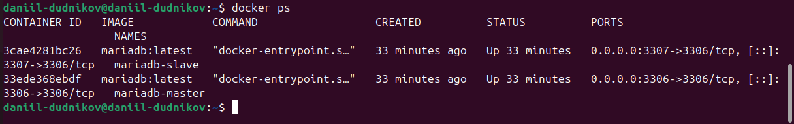
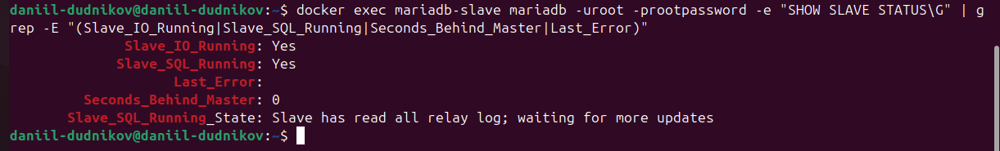
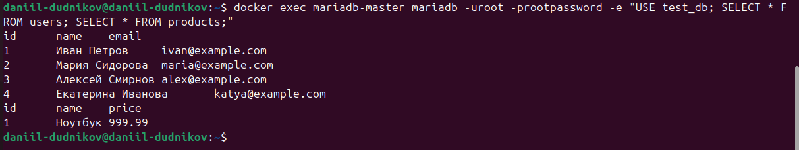
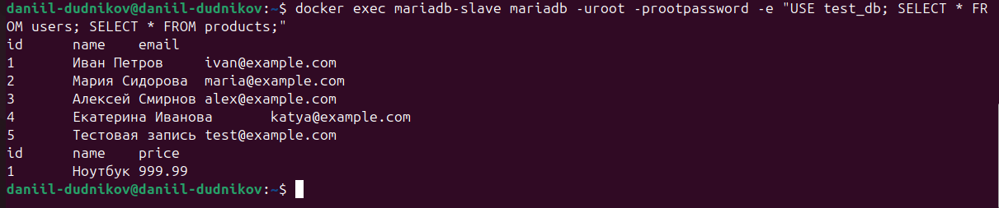
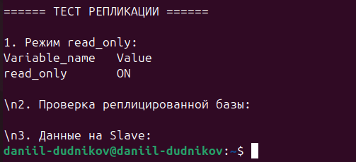

# Домашнее задание к занятию «Репликация и масштабирование. Часть 1»

**Выполнил:** Даниил Дудников

## Задание 1. Различия режимов репликации

## Ключевые различия:
- **Master-Slave**: Идеален для масштабирования чтения, прост в настройке
- **Master-Master**: Обеспечивает отказоустойчивость, сложен в поддержке

## Задание 2. Настройка Master-Slave репликации

### 1. Конфигурация серверов

Для настройки Master-Slave репликации использованы следующие конфигурационные файлы:

**Master сервер (my.cnf):**

**Slave сервер (my.cnf):**

**Ключевые параметры конфигурации:**
- `server-id = 1` для Master, `server-id = 2` для Slave
- `log_bin` - включение бинарного лога
- `read_only = 1` на Slave сервере
- `bind-address = 0.0.0.0` для подключений

### 2. Docker окружение

### 3. Статус репликации

**Ключевые показатели статуса репликации:**
- `Slave_IO_Running: Yes` - поток ввода/вывода работает
- `Slave_SQL_Running: Yes` - SQL поток работает  
- `Seconds_Behind_Master: 0` - отставания от Master нет
- `Last_Error:` - последних ошибок нет

### 4. Тестирование репликации данных

**Данные на Master сервере:**

**Данные на Slave сервере:**

### 5. Проверка режима read_only на Slave

**Результат проверки:**
- `read_only = ON` - Slave работает в режиме только для чтения
- Попытки записи на Slave будут вызывать ошибку 1290

## Выводы

1. **Master-Slave репликация успешно настроена** в Docker-окружении
2. **Данные корректно реплицируются** с Master на Slave сервер
3. **Slave сервер работает в режиме `read_only`**, что предотвращает случайную запись
4. **Репликация работает в реальном времени** без задержек
5. **Оба процесса репликации активны** (IO и SQL потоки)

**Рекомендации для production-среды:**
- Всегда проверять `read_only = ON` на Slave серверах
- Регулярно мониторить статус репликации
- Контролировать согласованность данных между Master и Slave

